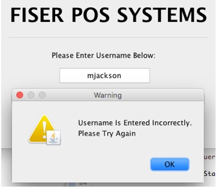

<html xmlns:v="urn:schemas-microsoft-com:vml"
xmlns:o="urn:schemas-microsoft-com:office:office"
xmlns:w="urn:schemas-microsoft-com:office:word"
xmlns:m="http://schemas.microsoft.com/office/2004/12/omml"
xmlns="http://www.w3.org/TR/REC-html40">

<head>
<meta http-equiv=Content-Type content="text/html; charset=utf-8">
<meta name=ProgId content=Word.Document>
<meta name=Generator content="Microsoft Word 15">
<meta name=Originator content="Microsoft Word 15">
<link rel=File-List href="Application_Manual.fld/filelist.xml">
<link rel=Edit-Time-Data href="Application_Manual.fld/editdata.mso">
<!--[if !mso]>

<![endif]-->
<link rel=themeData href="Application_Manual.fld/themedata.thmx">
<link rel=colorSchemeMapping
href="Application_Manual.fld/colorschememapping.xml">
<!--[if gte mso 9]><xml>
 <w:WordDocument>
  <w:SpellingState>Clean</w:SpellingState>
  <w:GrammarState>Clean</w:GrammarState>
  <w:TrackMoves>false</w:TrackMoves>
  <w:TrackFormatting/>
  <w:PunctuationKerning/>
  <w:ValidateAgainstSchemas/>
  <w:SaveIfXMLInvalid>false</w:SaveIfXMLInvalid>
  <w:IgnoreMixedContent>false</w:IgnoreMixedContent>
  <w:AlwaysShowPlaceholderText>false</w:AlwaysShowPlaceholderText>
  <w:DoNotPromoteQF/>
  <w:LidThemeOther>EN-US</w:LidThemeOther>
  <w:LidThemeAsian>X-NONE</w:LidThemeAsian>
  <w:LidThemeComplexScript>X-NONE</w:LidThemeComplexScript>
  <w:Compatibility>
   <w:BreakWrappedTables/>
   <w:SnapToGridInCell/>
   <w:WrapTextWithPunct/>
   <w:UseAsianBreakRules/>
   <w:DontGrowAutofit/>
   <w:SplitPgBreakAndParaMark/>
   <w:EnableOpenTypeKerning/>
   <w:DontFlipMirrorIndents/>
   <w:OverrideTableStyleHps/>
  </w:Compatibility>
  <w:DoNotOptimizeForBrowser/>
  <m:mathPr>
   <m:mathFont m:val="Cambria Math"/>
   <m:brkBin m:val="before"/>
   <m:brkBinSub m:val="&#45;-"/>
   <m:smallFrac m:val="off"/>
   <m:dispDef/>
   <m:lMargin m:val="0"/>
   <m:rMargin m:val="0"/>
   <m:defJc m:val="centerGroup"/>
   <m:wrapIndent m:val="1440"/>
   <m:intLim m:val="subSup"/>
   <m:naryLim m:val="undOvr"/>
  </m:mathPr></w:WordDocument>
</xml><![endif]--><!--[if gte mso 9]><xml>
 <w:LatentStyles DefLockedState="false" DefUnhideWhenUsed="false"
  DefSemiHidden="false" DefQFormat="false" DefPriority="99"
  LatentStyleCount="375">
  <w:LsdException Locked="false" Priority="0" QFormat="true" Name="Normal"/>
  <w:LsdException Locked="false" Priority="9" QFormat="true" Name="heading 1"/>
  <w:LsdException Locked="false" Priority="9" SemiHidden="true"
   UnhideWhenUsed="true" QFormat="true" Name="heading 2"/>
  <w:LsdException Locked="false" Priority="9" SemiHidden="true"
   UnhideWhenUsed="true" QFormat="true" Name="heading 3"/>
  <w:LsdException Locked="false" Priority="9" SemiHidden="true"
   UnhideWhenUsed="true" QFormat="true" Name="heading 4"/>
  <w:LsdException Locked="false" Priority="9" SemiHidden="true"
   UnhideWhenUsed="true" QFormat="true" Name="heading 5"/>
  <w:LsdException Locked="false" Priority="9" SemiHidden="true"
   UnhideWhenUsed="true" QFormat="true" Name="heading 6"/>
  <w:LsdException Locked="false" Priority="9" SemiHidden="true"
   UnhideWhenUsed="true" QFormat="true" Name="heading 7"/>
  <w:LsdException Locked="false" Priority="9" SemiHidden="true"
   UnhideWhenUsed="true" QFormat="true" Name="heading 8"/>
  <w:LsdException Locked="false" Priority="9" SemiHidden="true"
   UnhideWhenUsed="true" QFormat="true" Name="heading 9"/>
  <w:LsdException Locked="false" SemiHidden="true" UnhideWhenUsed="true"
   Name="index 1"/>
  <w:LsdException Locked="false" SemiHidden="true" UnhideWhenUsed="true"
   Name="index 2"/>
  <w:LsdException Locked="false" SemiHidden="true" UnhideWhenUsed="true"
   Name="index 3"/>
  <w:LsdException Locked="false" SemiHidden="true" UnhideWhenUsed="true"
   Name="index 4"/>
  <w:LsdException Locked="false" SemiHidden="true" UnhideWhenUsed="true"
   Name="index 5"/>
  <w:LsdException Locked="false" SemiHidden="true" UnhideWhenUsed="true"
   Name="index 6"/>
  <w:LsdException Locked="false" SemiHidden="true" UnhideWhenUsed="true"
   Name="index 7"/>
  <w:LsdException Locked="false" SemiHidden="true" UnhideWhenUsed="true"
   Name="index 8"/>
  <w:LsdException Locked="false" SemiHidden="true" UnhideWhenUsed="true"
   Name="index 9"/>
  <w:LsdException Locked="false" Priority="39" SemiHidden="true"
   UnhideWhenUsed="true" Name="toc 1"/>
  <w:LsdException Locked="false" Priority="39" SemiHidden="true"
   UnhideWhenUsed="true" Name="toc 2"/>
  <w:LsdException Locked="false" Priority="39" SemiHidden="true"
   UnhideWhenUsed="true" Name="toc 3"/>
  <w:LsdException Locked="false" Priority="39" SemiHidden="true"
   UnhideWhenUsed="true" Name="toc 4"/>
  <w:LsdException Locked="false" Priority="39" SemiHidden="true"
   UnhideWhenUsed="true" Name="toc 5"/>
  <w:LsdException Locked="false" Priority="39" SemiHidden="true"
   UnhideWhenUsed="true" Name="toc 6"/>
  <w:LsdException Locked="false" Priority="39" SemiHidden="true"
   UnhideWhenUsed="true" Name="toc 7"/>
  <w:LsdException Locked="false" Priority="39" SemiHidden="true"
   UnhideWhenUsed="true" Name="toc 8"/>
  <w:LsdException Locked="false" Priority="39" SemiHidden="true"
   UnhideWhenUsed="true" Name="toc 9"/>
  <w:LsdException Locked="false" SemiHidden="true" UnhideWhenUsed="true"
   Name="Normal Indent"/>
  <w:LsdException Locked="false" SemiHidden="true" UnhideWhenUsed="true"
   Name="footnote text"/>
  <w:LsdException Locked="false" SemiHidden="true" UnhideWhenUsed="true"
   Name="annotation text"/>
  <w:LsdException Locked="false" SemiHidden="true" UnhideWhenUsed="true"
   Name="header"/>
  <w:LsdException Locked="false" SemiHidden="true" UnhideWhenUsed="true"
   Name="footer"/>
  <w:LsdException Locked="false" SemiHidden="true" UnhideWhenUsed="true"
   Name="index heading"/>
  <w:LsdException Locked="false" Priority="35" SemiHidden="true"
   UnhideWhenUsed="true" QFormat="true" Name="caption"/>
  <w:LsdException Locked="false" SemiHidden="true" UnhideWhenUsed="true"
   Name="table of figures"/>
  <w:LsdException Locked="false" SemiHidden="true" UnhideWhenUsed="true"
   Name="envelope address"/>
  <w:LsdException Locked="false" SemiHidden="true" UnhideWhenUsed="true"
   Name="envelope return"/>
  <w:LsdException Locked="false" SemiHidden="true" UnhideWhenUsed="true"
   Name="footnote reference"/>
  <w:LsdException Locked="false" SemiHidden="true" UnhideWhenUsed="true"
   Name="annotation reference"/>
  <w:LsdException Locked="false" SemiHidden="true" UnhideWhenUsed="true"
   Name="line number"/>
  <w:LsdException Locked="false" SemiHidden="true" UnhideWhenUsed="true"
   Name="page number"/>
  <w:LsdException Locked="false" SemiHidden="true" UnhideWhenUsed="true"
   Name="endnote reference"/>
  <w:LsdException Locked="false" SemiHidden="true" UnhideWhenUsed="true"
   Name="endnote text"/>
  <w:LsdException Locked="false" SemiHidden="true" UnhideWhenUsed="true"
   Name="table of authorities"/>
  <w:LsdException Locked="false" SemiHidden="true" UnhideWhenUsed="true"
   Name="macro"/>
  <w:LsdException Locked="false" SemiHidden="true" UnhideWhenUsed="true"
   Name="toa heading"/>
  <w:LsdException Locked="false" SemiHidden="true" UnhideWhenUsed="true"
   Name="List"/>
  <w:LsdException Locked="false" SemiHidden="true" UnhideWhenUsed="true"
   Name="List Bullet"/>
  <w:LsdException Locked="false" SemiHidden="true" UnhideWhenUsed="true"
   Name="List Number"/>
  <w:LsdException Locked="false" SemiHidden="true" UnhideWhenUsed="true"
   Name="List 2"/>
  <w:LsdException Locked="false" SemiHidden="true" UnhideWhenUsed="true"
   Name="List 3"/>
  <w:LsdException Locked="false" SemiHidden="true" UnhideWhenUsed="true"
   Name="List 4"/>
  <w:LsdException Locked="false" SemiHidden="true" UnhideWhenUsed="true"
   Name="List 5"/>
  <w:LsdException Locked="false" SemiHidden="true" UnhideWhenUsed="true"
   Name="List Bullet 2"/>
  <w:LsdException Locked="false" SemiHidden="true" UnhideWhenUsed="true"
   Name="List Bullet 3"/>
  <w:LsdException Locked="false" SemiHidden="true" UnhideWhenUsed="true"
   Name="List Bullet 4"/>
  <w:LsdException Locked="false" SemiHidden="true" UnhideWhenUsed="true"
   Name="List Bullet 5"/>
  <w:LsdException Locked="false" SemiHidden="true" UnhideWhenUsed="true"
   Name="List Number 2"/>
  <w:LsdException Locked="false" SemiHidden="true" UnhideWhenUsed="true"
   Name="List Number 3"/>
  <w:LsdException Locked="false" SemiHidden="true" UnhideWhenUsed="true"
   Name="List Number 4"/>
  <w:LsdException Locked="false" SemiHidden="true" UnhideWhenUsed="true"
   Name="List Number 5"/>
  <w:LsdException Locked="false" Priority="10" QFormat="true" Name="Title"/>
  <w:LsdException Locked="false" SemiHidden="true" UnhideWhenUsed="true"
   Name="Closing"/>
  <w:LsdException Locked="false" SemiHidden="true" UnhideWhenUsed="true"
   Name="Signature"/>
  <w:LsdException Locked="false" Priority="1" SemiHidden="true"
   UnhideWhenUsed="true" Name="Default Paragraph Font"/>
  <w:LsdException Locked="false" SemiHidden="true" UnhideWhenUsed="true"
   Name="Body Text"/>
  <w:LsdException Locked="false" SemiHidden="true" UnhideWhenUsed="true"
   Name="Body Text Indent"/>
  <w:LsdException Locked="false" SemiHidden="true" UnhideWhenUsed="true"
   Name="List Continue"/>
  <w:LsdException Locked="false" SemiHidden="true" UnhideWhenUsed="true"
   Name="List Continue 2"/>
  <w:LsdException Locked="false" SemiHidden="true" UnhideWhenUsed="true"
   Name="List Continue 3"/>
  <w:LsdException Locked="false" SemiHidden="true" UnhideWhenUsed="true"
   Name="List Continue 4"/>
  <w:LsdException Locked="false" SemiHidden="true" UnhideWhenUsed="true"
   Name="List Continue 5"/>
  <w:LsdException Locked="false" SemiHidden="true" UnhideWhenUsed="true"
   Name="Message Header"/>
  <w:LsdException Locked="false" Priority="11" QFormat="true" Name="Subtitle"/>
  <w:LsdException Locked="false" SemiHidden="true" UnhideWhenUsed="true"
   Name="Salutation"/>
  <w:LsdException Locked="false" SemiHidden="true" UnhideWhenUsed="true"
   Name="Date"/>
  <w:LsdException Locked="false" SemiHidden="true" UnhideWhenUsed="true"
   Name="Body Text First Indent"/>
  <w:LsdException Locked="false" SemiHidden="true" UnhideWhenUsed="true"
   Name="Body Text First Indent 2"/>
  <w:LsdException Locked="false" SemiHidden="true" UnhideWhenUsed="true"
   Name="Note Heading"/>
  <w:LsdException Locked="false" SemiHidden="true" UnhideWhenUsed="true"
   Name="Body Text 2"/>
  <w:LsdException Locked="false" SemiHidden="true" UnhideWhenUsed="true"
   Name="Body Text 3"/>
  <w:LsdException Locked="false" SemiHidden="true" UnhideWhenUsed="true"
   Name="Body Text Indent 2"/>
  <w:LsdException Locked="false" SemiHidden="true" UnhideWhenUsed="true"
   Name="Body Text Indent 3"/>
  <w:LsdException Locked="false" SemiHidden="true" UnhideWhenUsed="true"
   Name="Block Text"/>
  <w:LsdException Locked="false" SemiHidden="true" UnhideWhenUsed="true"
   Name="Hyperlink"/>
  <w:LsdException Locked="false" SemiHidden="true" UnhideWhenUsed="true"
   Name="FollowedHyperlink"/>
  <w:LsdException Locked="false" Priority="22" QFormat="true" Name="Strong"/>
  <w:LsdException Locked="false" Priority="20" QFormat="true" Name="Emphasis"/>
  <w:LsdException Locked="false" SemiHidden="true" UnhideWhenUsed="true"
   Name="Document Map"/>
  <w:LsdException Locked="false" SemiHidden="true" UnhideWhenUsed="true"
   Name="Plain Text"/>
  <w:LsdException Locked="false" SemiHidden="true" UnhideWhenUsed="true"
   Name="E-mail Signature"/>
  <w:LsdException Locked="false" SemiHidden="true" UnhideWhenUsed="true"
   Name="HTML Top of Form"/>
  <w:LsdException Locked="false" SemiHidden="true" UnhideWhenUsed="true"
   Name="HTML Bottom of Form"/>
  <w:LsdException Locked="false" SemiHidden="true" UnhideWhenUsed="true"
   Name="Normal (Web)"/>
  <w:LsdException Locked="false" SemiHidden="true" UnhideWhenUsed="true"
   Name="HTML Acronym"/>
  <w:LsdException Locked="false" SemiHidden="true" UnhideWhenUsed="true"
   Name="HTML Address"/>
  <w:LsdException Locked="false" SemiHidden="true" UnhideWhenUsed="true"
   Name="HTML Cite"/>
  <w:LsdException Locked="false" SemiHidden="true" UnhideWhenUsed="true"
   Name="HTML Code"/>
  <w:LsdException Locked="false" SemiHidden="true" UnhideWhenUsed="true"
   Name="HTML Definition"/>
  <w:LsdException Locked="false" SemiHidden="true" UnhideWhenUsed="true"
   Name="HTML Keyboard"/>
  <w:LsdException Locked="false" SemiHidden="true" UnhideWhenUsed="true"
   Name="HTML Preformatted"/>
  <w:LsdException Locked="false" SemiHidden="true" UnhideWhenUsed="true"
   Name="HTML Sample"/>
  <w:LsdException Locked="false" SemiHidden="true" UnhideWhenUsed="true"
   Name="HTML Typewriter"/>
  <w:LsdException Locked="false" SemiHidden="true" UnhideWhenUsed="true"
   Name="HTML Variable"/>
  <w:LsdException Locked="false" SemiHidden="true" UnhideWhenUsed="true"
   Name="Normal Table"/>
  <w:LsdException Locked="false" SemiHidden="true" UnhideWhenUsed="true"
   Name="annotation subject"/>
  <w:LsdException Locked="false" SemiHidden="true" UnhideWhenUsed="true"
   Name="No List"/>
  <w:LsdException Locked="false" SemiHidden="true" UnhideWhenUsed="true"
   Name="Outline List 1"/>
  <w:LsdException Locked="false" SemiHidden="true" UnhideWhenUsed="true"
   Name="Outline List 2"/>
  <w:LsdException Locked="false" SemiHidden="true" UnhideWhenUsed="true"
   Name="Outline List 3"/>
  <w:LsdException Locked="false" SemiHidden="true" UnhideWhenUsed="true"
   Name="Table Simple 1"/>
  <w:LsdException Locked="false" SemiHidden="true" UnhideWhenUsed="true"
   Name="Table Simple 2"/>
  <w:LsdException Locked="false" SemiHidden="true" UnhideWhenUsed="true"
   Name="Table Simple 3"/>
  <w:LsdException Locked="false" SemiHidden="true" UnhideWhenUsed="true"
   Name="Table Classic 1"/>
  <w:LsdException Locked="false" SemiHidden="true" UnhideWhenUsed="true"
   Name="Table Classic 2"/>
  <w:LsdException Locked="false" SemiHidden="true" UnhideWhenUsed="true"
   Name="Table Classic 3"/>
  <w:LsdException Locked="false" SemiHidden="true" UnhideWhenUsed="true"
   Name="Table Classic 4"/>
  <w:LsdException Locked="false" SemiHidden="true" UnhideWhenUsed="true"
   Name="Table Colorful 1"/>
  <w:LsdException Locked="false" SemiHidden="true" UnhideWhenUsed="true"
   Name="Table Colorful 2"/>
  <w:LsdException Locked="false" SemiHidden="true" UnhideWhenUsed="true"
   Name="Table Colorful 3"/>
  <w:LsdException Locked="false" SemiHidden="true" UnhideWhenUsed="true"
   Name="Table Columns 1"/>
  <w:LsdException Locked="false" SemiHidden="true" UnhideWhenUsed="true"
   Name="Table Columns 2"/>
  <w:LsdException Locked="false" SemiHidden="true" UnhideWhenUsed="true"
   Name="Table Columns 3"/>
  <w:LsdException Locked="false" SemiHidden="true" UnhideWhenUsed="true"
   Name="Table Columns 4"/>
  <w:LsdException Locked="false" SemiHidden="true" UnhideWhenUsed="true"
   Name="Table Columns 5"/>
  <w:LsdException Locked="false" SemiHidden="true" UnhideWhenUsed="true"
   Name="Table Grid 1"/>
  <w:LsdException Locked="false" SemiHidden="true" UnhideWhenUsed="true"
   Name="Table Grid 2"/>
  <w:LsdException Locked="false" SemiHidden="true" UnhideWhenUsed="true"
   Name="Table Grid 3"/>
  <w:LsdException Locked="false" SemiHidden="true" UnhideWhenUsed="true"
   Name="Table Grid 4"/>
  <w:LsdException Locked="false" SemiHidden="true" UnhideWhenUsed="true"
   Name="Table Grid 5"/>
  <w:LsdException Locked="false" SemiHidden="true" UnhideWhenUsed="true"
   Name="Table Grid 6"/>
  <w:LsdException Locked="false" SemiHidden="true" UnhideWhenUsed="true"
   Name="Table Grid 7"/>
  <w:LsdException Locked="false" SemiHidden="true" UnhideWhenUsed="true"
   Name="Table Grid 8"/>
  <w:LsdException Locked="false" SemiHidden="true" UnhideWhenUsed="true"
   Name="Table List 1"/>
  <w:LsdException Locked="false" SemiHidden="true" UnhideWhenUsed="true"
   Name="Table List 2"/>
  <w:LsdException Locked="false" SemiHidden="true" UnhideWhenUsed="true"
   Name="Table List 3"/>
  <w:LsdException Locked="false" SemiHidden="true" UnhideWhenUsed="true"
   Name="Table List 4"/>
  <w:LsdException Locked="false" SemiHidden="true" UnhideWhenUsed="true"
   Name="Table List 5"/>
  <w:LsdException Locked="false" SemiHidden="true" UnhideWhenUsed="true"
   Name="Table List 6"/>
  <w:LsdException Locked="false" SemiHidden="true" UnhideWhenUsed="true"
   Name="Table List 7"/>
  <w:LsdException Locked="false" SemiHidden="true" UnhideWhenUsed="true"
   Name="Table List 8"/>
  <w:LsdException Locked="false" SemiHidden="true" UnhideWhenUsed="true"
   Name="Table 3D effects 1"/>
  <w:LsdException Locked="false" SemiHidden="true" UnhideWhenUsed="true"
   Name="Table 3D effects 2"/>
  <w:LsdException Locked="false" SemiHidden="true" UnhideWhenUsed="true"
   Name="Table 3D effects 3"/>
  <w:LsdException Locked="false" SemiHidden="true" UnhideWhenUsed="true"
   Name="Table Contemporary"/>
  <w:LsdException Locked="false" SemiHidden="true" UnhideWhenUsed="true"
   Name="Table Elegant"/>
  <w:LsdException Locked="false" SemiHidden="true" UnhideWhenUsed="true"
   Name="Table Professional"/>
  <w:LsdException Locked="false" SemiHidden="true" UnhideWhenUsed="true"
   Name="Table Subtle 1"/>
  <w:LsdException Locked="false" SemiHidden="true" UnhideWhenUsed="true"
   Name="Table Subtle 2"/>
  <w:LsdException Locked="false" SemiHidden="true" UnhideWhenUsed="true"
   Name="Table Web 1"/>
  <w:LsdException Locked="false" SemiHidden="true" UnhideWhenUsed="true"
   Name="Table Web 2"/>
  <w:LsdException Locked="false" SemiHidden="true" UnhideWhenUsed="true"
   Name="Table Web 3"/>
  <w:LsdException Locked="false" SemiHidden="true" UnhideWhenUsed="true"
   Name="Balloon Text"/>
  <w:LsdException Locked="false" Priority="39" Name="Table Grid"/>
  <w:LsdException Locked="false" SemiHidden="true" UnhideWhenUsed="true"
   Name="Table Theme"/>
  <w:LsdException Locked="false" SemiHidden="true" Name="Placeholder Text"/>
  <w:LsdException Locked="false" Priority="1" QFormat="true" Name="No Spacing"/>
  <w:LsdException Locked="false" Priority="60" Name="Light Shading"/>
  <w:LsdException Locked="false" Priority="61" Name="Light List"/>
  <w:LsdException Locked="false" Priority="62" Name="Light Grid"/>
  <w:LsdException Locked="false" Priority="63" Name="Medium Shading 1"/>
  <w:LsdException Locked="false" Priority="64" Name="Medium Shading 2"/>
  <w:LsdException Locked="false" Priority="65" Name="Medium List 1"/>
  <w:LsdException Locked="false" Priority="66" Name="Medium List 2"/>
  <w:LsdException Locked="false" Priority="67" Name="Medium Grid 1"/>
  <w:LsdException Locked="false" Priority="68" Name="Medium Grid 2"/>
  <w:LsdException Locked="false" Priority="69" Name="Medium Grid 3"/>
  <w:LsdException Locked="false" Priority="70" Name="Dark List"/>
  <w:LsdException Locked="false" Priority="71" Name="Colorful Shading"/>
  <w:LsdException Locked="false" Priority="72" Name="Colorful List"/>
  <w:LsdException Locked="false" Priority="73" Name="Colorful Grid"/>
  <w:LsdException Locked="false" Priority="60" Name="Light Shading Accent 1"/>
  <w:LsdException Locked="false" Priority="61" Name="Light List Accent 1"/>
  <w:LsdException Locked="false" Priority="62" Name="Light Grid Accent 1"/>
  <w:LsdException Locked="false" Priority="63" Name="Medium Shading 1 Accent 1"/>
  <w:LsdException Locked="false" Priority="64" Name="Medium Shading 2 Accent 1"/>
  <w:LsdException Locked="false" Priority="65" Name="Medium List 1 Accent 1"/>
  <w:LsdException Locked="false" SemiHidden="true" Name="Revision"/>
  <w:LsdException Locked="false" Priority="34" QFormat="true"
   Name="List Paragraph"/>
  <w:LsdException Locked="false" Priority="29" QFormat="true" Name="Quote"/>
  <w:LsdException Locked="false" Priority="30" QFormat="true"
   Name="Intense Quote"/>
  <w:LsdException Locked="false" Priority="66" Name="Medium List 2 Accent 1"/>
  <w:LsdException Locked="false" Priority="67" Name="Medium Grid 1 Accent 1"/>
  <w:LsdException Locked="false" Priority="68" Name="Medium Grid 2 Accent 1"/>
  <w:LsdException Locked="false" Priority="69" Name="Medium Grid 3 Accent 1"/>
  <w:LsdException Locked="false" Priority="70" Name="Dark List Accent 1"/>
  <w:LsdException Locked="false" Priority="71" Name="Colorful Shading Accent 1"/>
  <w:LsdException Locked="false" Priority="72" Name="Colorful List Accent 1"/>
  <w:LsdException Locked="false" Priority="73" Name="Colorful Grid Accent 1"/>
  <w:LsdException Locked="false" Priority="60" Name="Light Shading Accent 2"/>
  <w:LsdException Locked="false" Priority="61" Name="Light List Accent 2"/>
  <w:LsdException Locked="false" Priority="62" Name="Light Grid Accent 2"/>
  <w:LsdException Locked="false" Priority="63" Name="Medium Shading 1 Accent 2"/>
  <w:LsdException Locked="false" Priority="64" Name="Medium Shading 2 Accent 2"/>
  <w:LsdException Locked="false" Priority="65" Name="Medium List 1 Accent 2"/>
  <w:LsdException Locked="false" Priority="66" Name="Medium List 2 Accent 2"/>
  <w:LsdException Locked="false" Priority="67" Name="Medium Grid 1 Accent 2"/>
  <w:LsdException Locked="false" Priority="68" Name="Medium Grid 2 Accent 2"/>
  <w:LsdException Locked="false" Priority="69" Name="Medium Grid 3 Accent 2"/>
  <w:LsdException Locked="false" Priority="70" Name="Dark List Accent 2"/>
  <w:LsdException Locked="false" Priority="71" Name="Colorful Shading Accent 2"/>
  <w:LsdException Locked="false" Priority="72" Name="Colorful List Accent 2"/>
  <w:LsdException Locked="false" Priority="73" Name="Colorful Grid Accent 2"/>
  <w:LsdException Locked="false" Priority="60" Name="Light Shading Accent 3"/>
  <w:LsdException Locked="false" Priority="61" Name="Light List Accent 3"/>
  <w:LsdException Locked="false" Priority="62" Name="Light Grid Accent 3"/>
  <w:LsdException Locked="false" Priority="63" Name="Medium Shading 1 Accent 3"/>
  <w:LsdException Locked="false" Priority="64" Name="Medium Shading 2 Accent 3"/>
  <w:LsdException Locked="false" Priority="65" Name="Medium List 1 Accent 3"/>
  <w:LsdException Locked="false" Priority="66" Name="Medium List 2 Accent 3"/>
  <w:LsdException Locked="false" Priority="67" Name="Medium Grid 1 Accent 3"/>
  <w:LsdException Locked="false" Priority="68" Name="Medium Grid 2 Accent 3"/>
  <w:LsdException Locked="false" Priority="69" Name="Medium Grid 3 Accent 3"/>
  <w:LsdException Locked="false" Priority="70" Name="Dark List Accent 3"/>
  <w:LsdException Locked="false" Priority="71" Name="Colorful Shading Accent 3"/>
  <w:LsdException Locked="false" Priority="72" Name="Colorful List Accent 3"/>
  <w:LsdException Locked="false" Priority="73" Name="Colorful Grid Accent 3"/>
  <w:LsdException Locked="false" Priority="60" Name="Light Shading Accent 4"/>
  <w:LsdException Locked="false" Priority="61" Name="Light List Accent 4"/>
  <w:LsdException Locked="false" Priority="62" Name="Light Grid Accent 4"/>
  <w:LsdException Locked="false" Priority="63" Name="Medium Shading 1 Accent 4"/>
  <w:LsdException Locked="false" Priority="64" Name="Medium Shading 2 Accent 4"/>
  <w:LsdException Locked="false" Priority="65" Name="Medium List 1 Accent 4"/>
  <w:LsdException Locked="false" Priority="66" Name="Medium List 2 Accent 4"/>
  <w:LsdException Locked="false" Priority="67" Name="Medium Grid 1 Accent 4"/>
  <w:LsdException Locked="false" Priority="68" Name="Medium Grid 2 Accent 4"/>
  <w:LsdException Locked="false" Priority="69" Name="Medium Grid 3 Accent 4"/>
  <w:LsdException Locked="false" Priority="70" Name="Dark List Accent 4"/>
  <w:LsdException Locked="false" Priority="71" Name="Colorful Shading Accent 4"/>
  <w:LsdException Locked="false" Priority="72" Name="Colorful List Accent 4"/>
  <w:LsdException Locked="false" Priority="73" Name="Colorful Grid Accent 4"/>
  <w:LsdException Locked="false" Priority="60" Name="Light Shading Accent 5"/>
  <w:LsdException Locked="false" Priority="61" Name="Light List Accent 5"/>
  <w:LsdException Locked="false" Priority="62" Name="Light Grid Accent 5"/>
  <w:LsdException Locked="false" Priority="63" Name="Medium Shading 1 Accent 5"/>
  <w:LsdException Locked="false" Priority="64" Name="Medium Shading 2 Accent 5"/>
  <w:LsdException Locked="false" Priority="65" Name="Medium List 1 Accent 5"/>
  <w:LsdException Locked="false" Priority="66" Name="Medium List 2 Accent 5"/>
  <w:LsdException Locked="false" Priority="67" Name="Medium Grid 1 Accent 5"/>
  <w:LsdException Locked="false" Priority="68" Name="Medium Grid 2 Accent 5"/>
  <w:LsdException Locked="false" Priority="69" Name="Medium Grid 3 Accent 5"/>
  <w:LsdException Locked="false" Priority="70" Name="Dark List Accent 5"/>
  <w:LsdException Locked="false" Priority="71" Name="Colorful Shading Accent 5"/>
  <w:LsdException Locked="false" Priority="72" Name="Colorful List Accent 5"/>
  <w:LsdException Locked="false" Priority="73" Name="Colorful Grid Accent 5"/>
  <w:LsdException Locked="false" Priority="60" Name="Light Shading Accent 6"/>
  <w:LsdException Locked="false" Priority="61" Name="Light List Accent 6"/>
  <w:LsdException Locked="false" Priority="62" Name="Light Grid Accent 6"/>
  <w:LsdException Locked="false" Priority="63" Name="Medium Shading 1 Accent 6"/>
  <w:LsdException Locked="false" Priority="64" Name="Medium Shading 2 Accent 6"/>
  <w:LsdException Locked="false" Priority="65" Name="Medium List 1 Accent 6"/>
  <w:LsdException Locked="false" Priority="66" Name="Medium List 2 Accent 6"/>
  <w:LsdException Locked="false" Priority="67" Name="Medium Grid 1 Accent 6"/>
  <w:LsdException Locked="false" Priority="68" Name="Medium Grid 2 Accent 6"/>
  <w:LsdException Locked="false" Priority="69" Name="Medium Grid 3 Accent 6"/>
  <w:LsdException Locked="false" Priority="70" Name="Dark List Accent 6"/>
  <w:LsdException Locked="false" Priority="71" Name="Colorful Shading Accent 6"/>
  <w:LsdException Locked="false" Priority="72" Name="Colorful List Accent 6"/>
  <w:LsdException Locked="false" Priority="73" Name="Colorful Grid Accent 6"/>
  <w:LsdException Locked="false" Priority="19" QFormat="true"
   Name="Subtle Emphasis"/>
  <w:LsdException Locked="false" Priority="21" QFormat="true"
   Name="Intense Emphasis"/>
  <w:LsdException Locked="false" Priority="31" QFormat="true"
   Name="Subtle Reference"/>
  <w:LsdException Locked="false" Priority="32" QFormat="true"
   Name="Intense Reference"/>
  <w:LsdException Locked="false" Priority="33" QFormat="true" Name="Book Title"/>
  <w:LsdException Locked="false" Priority="37" SemiHidden="true"
   UnhideWhenUsed="true" Name="Bibliography"/>
  <w:LsdException Locked="false" Priority="39" SemiHidden="true"
   UnhideWhenUsed="true" QFormat="true" Name="TOC Heading"/>
  <w:LsdException Locked="false" Priority="41" Name="Plain Table 1"/>
  <w:LsdException Locked="false" Priority="42" Name="Plain Table 2"/>
  <w:LsdException Locked="false" Priority="43" Name="Plain Table 3"/>
  <w:LsdException Locked="false" Priority="44" Name="Plain Table 4"/>
  <w:LsdException Locked="false" Priority="45" Name="Plain Table 5"/>
  <w:LsdException Locked="false" Priority="40" Name="Grid Table Light"/>
  <w:LsdException Locked="false" Priority="46" Name="Grid Table 1 Light"/>
  <w:LsdException Locked="false" Priority="47" Name="Grid Table 2"/>
  <w:LsdException Locked="false" Priority="48" Name="Grid Table 3"/>
  <w:LsdException Locked="false" Priority="49" Name="Grid Table 4"/>
  <w:LsdException Locked="false" Priority="50" Name="Grid Table 5 Dark"/>
  <w:LsdException Locked="false" Priority="51" Name="Grid Table 6 Colorful"/>
  <w:LsdException Locked="false" Priority="52" Name="Grid Table 7 Colorful"/>
  <w:LsdException Locked="false" Priority="46"
   Name="Grid Table 1 Light Accent 1"/>
  <w:LsdException Locked="false" Priority="47" Name="Grid Table 2 Accent 1"/>
  <w:LsdException Locked="false" Priority="48" Name="Grid Table 3 Accent 1"/>
  <w:LsdException Locked="false" Priority="49" Name="Grid Table 4 Accent 1"/>
  <w:LsdException Locked="false" Priority="50" Name="Grid Table 5 Dark Accent 1"/>
  <w:LsdException Locked="false" Priority="51"
   Name="Grid Table 6 Colorful Accent 1"/>
  <w:LsdException Locked="false" Priority="52"
   Name="Grid Table 7 Colorful Accent 1"/>
  <w:LsdException Locked="false" Priority="46"
   Name="Grid Table 1 Light Accent 2"/>
  <w:LsdException Locked="false" Priority="47" Name="Grid Table 2 Accent 2"/>
  <w:LsdException Locked="false" Priority="48" Name="Grid Table 3 Accent 2"/>
  <w:LsdException Locked="false" Priority="49" Name="Grid Table 4 Accent 2"/>
  <w:LsdException Locked="false" Priority="50" Name="Grid Table 5 Dark Accent 2"/>
  <w:LsdException Locked="false" Priority="51"
   Name="Grid Table 6 Colorful Accent 2"/>
  <w:LsdException Locked="false" Priority="52"
   Name="Grid Table 7 Colorful Accent 2"/>
  <w:LsdException Locked="false" Priority="46"
   Name="Grid Table 1 Light Accent 3"/>
  <w:LsdException Locked="false" Priority="47" Name="Grid Table 2 Accent 3"/>
  <w:LsdException Locked="false" Priority="48" Name="Grid Table 3 Accent 3"/>
  <w:LsdException Locked="false" Priority="49" Name="Grid Table 4 Accent 3"/>
  <w:LsdException Locked="false" Priority="50" Name="Grid Table 5 Dark Accent 3"/>
  <w:LsdException Locked="false" Priority="51"
   Name="Grid Table 6 Colorful Accent 3"/>
  <w:LsdException Locked="false" Priority="52"
   Name="Grid Table 7 Colorful Accent 3"/>
  <w:LsdException Locked="false" Priority="46"
   Name="Grid Table 1 Light Accent 4"/>
  <w:LsdException Locked="false" Priority="47" Name="Grid Table 2 Accent 4"/>
  <w:LsdException Locked="false" Priority="48" Name="Grid Table 3 Accent 4"/>
  <w:LsdException Locked="false" Priority="49" Name="Grid Table 4 Accent 4"/>
  <w:LsdException Locked="false" Priority="50" Name="Grid Table 5 Dark Accent 4"/>
  <w:LsdException Locked="false" Priority="51"
   Name="Grid Table 6 Colorful Accent 4"/>
  <w:LsdException Locked="false" Priority="52"
   Name="Grid Table 7 Colorful Accent 4"/>
  <w:LsdException Locked="false" Priority="46"
   Name="Grid Table 1 Light Accent 5"/>
  <w:LsdException Locked="false" Priority="47" Name="Grid Table 2 Accent 5"/>
  <w:LsdException Locked="false" Priority="48" Name="Grid Table 3 Accent 5"/>
  <w:LsdException Locked="false" Priority="49" Name="Grid Table 4 Accent 5"/>
  <w:LsdException Locked="false" Priority="50" Name="Grid Table 5 Dark Accent 5"/>
  <w:LsdException Locked="false" Priority="51"
   Name="Grid Table 6 Colorful Accent 5"/>
  <w:LsdException Locked="false" Priority="52"
   Name="Grid Table 7 Colorful Accent 5"/>
  <w:LsdException Locked="false" Priority="46"
   Name="Grid Table 1 Light Accent 6"/>
  <w:LsdException Locked="false" Priority="47" Name="Grid Table 2 Accent 6"/>
  <w:LsdException Locked="false" Priority="48" Name="Grid Table 3 Accent 6"/>
  <w:LsdException Locked="false" Priority="49" Name="Grid Table 4 Accent 6"/>
  <w:LsdException Locked="false" Priority="50" Name="Grid Table 5 Dark Accent 6"/>
  <w:LsdException Locked="false" Priority="51"
   Name="Grid Table 6 Colorful Accent 6"/>
  <w:LsdException Locked="false" Priority="52"
   Name="Grid Table 7 Colorful Accent 6"/>
  <w:LsdException Locked="false" Priority="46" Name="List Table 1 Light"/>
  <w:LsdException Locked="false" Priority="47" Name="List Table 2"/>
  <w:LsdException Locked="false" Priority="48" Name="List Table 3"/>
  <w:LsdException Locked="false" Priority="49" Name="List Table 4"/>
  <w:LsdException Locked="false" Priority="50" Name="List Table 5 Dark"/>
  <w:LsdException Locked="false" Priority="51" Name="List Table 6 Colorful"/>
  <w:LsdException Locked="false" Priority="52" Name="List Table 7 Colorful"/>
  <w:LsdException Locked="false" Priority="46"
   Name="List Table 1 Light Accent 1"/>
  <w:LsdException Locked="false" Priority="47" Name="List Table 2 Accent 1"/>
  <w:LsdException Locked="false" Priority="48" Name="List Table 3 Accent 1"/>
  <w:LsdException Locked="false" Priority="49" Name="List Table 4 Accent 1"/>
  <w:LsdException Locked="false" Priority="50" Name="List Table 5 Dark Accent 1"/>
  <w:LsdException Locked="false" Priority="51"
   Name="List Table 6 Colorful Accent 1"/>
  <w:LsdException Locked="false" Priority="52"
   Name="List Table 7 Colorful Accent 1"/>
  <w:LsdException Locked="false" Priority="46"
   Name="List Table 1 Light Accent 2"/>
  <w:LsdException Locked="false" Priority="47" Name="List Table 2 Accent 2"/>
  <w:LsdException Locked="false" Priority="48" Name="List Table 3 Accent 2"/>
  <w:LsdException Locked="false" Priority="49" Name="List Table 4 Accent 2"/>
  <w:LsdException Locked="false" Priority="50" Name="List Table 5 Dark Accent 2"/>
  <w:LsdException Locked="false" Priority="51"
   Name="List Table 6 Colorful Accent 2"/>
  <w:LsdException Locked="false" Priority="52"
   Name="List Table 7 Colorful Accent 2"/>
  <w:LsdException Locked="false" Priority="46"
   Name="List Table 1 Light Accent 3"/>
  <w:LsdException Locked="false" Priority="47" Name="List Table 2 Accent 3"/>
  <w:LsdException Locked="false" Priority="48" Name="List Table 3 Accent 3"/>
  <w:LsdException Locked="false" Priority="49" Name="List Table 4 Accent 3"/>
  <w:LsdException Locked="false" Priority="50" Name="List Table 5 Dark Accent 3"/>
  <w:LsdException Locked="false" Priority="51"
   Name="List Table 6 Colorful Accent 3"/>
  <w:LsdException Locked="false" Priority="52"
   Name="List Table 7 Colorful Accent 3"/>
  <w:LsdException Locked="false" Priority="46"
   Name="List Table 1 Light Accent 4"/>
  <w:LsdException Locked="false" Priority="47" Name="List Table 2 Accent 4"/>
  <w:LsdException Locked="false" Priority="48" Name="List Table 3 Accent 4"/>
  <w:LsdException Locked="false" Priority="49" Name="List Table 4 Accent 4"/>
  <w:LsdException Locked="false" Priority="50" Name="List Table 5 Dark Accent 4"/>
  <w:LsdException Locked="false" Priority="51"
   Name="List Table 6 Colorful Accent 4"/>
  <w:LsdException Locked="false" Priority="52"
   Name="List Table 7 Colorful Accent 4"/>
  <w:LsdException Locked="false" Priority="46"
   Name="List Table 1 Light Accent 5"/>
  <w:LsdException Locked="false" Priority="47" Name="List Table 2 Accent 5"/>
  <w:LsdException Locked="false" Priority="48" Name="List Table 3 Accent 5"/>
  <w:LsdException Locked="false" Priority="49" Name="List Table 4 Accent 5"/>
  <w:LsdException Locked="false" Priority="50" Name="List Table 5 Dark Accent 5"/>
  <w:LsdException Locked="false" Priority="51"
   Name="List Table 6 Colorful Accent 5"/>
  <w:LsdException Locked="false" Priority="52"
   Name="List Table 7 Colorful Accent 5"/>
  <w:LsdException Locked="false" Priority="46"
   Name="List Table 1 Light Accent 6"/>
  <w:LsdException Locked="false" Priority="47" Name="List Table 2 Accent 6"/>
  <w:LsdException Locked="false" Priority="48" Name="List Table 3 Accent 6"/>
  <w:LsdException Locked="false" Priority="49" Name="List Table 4 Accent 6"/>
  <w:LsdException Locked="false" Priority="50" Name="List Table 5 Dark Accent 6"/>
  <w:LsdException Locked="false" Priority="51"
   Name="List Table 6 Colorful Accent 6"/>
  <w:LsdException Locked="false" Priority="52"
   Name="List Table 7 Colorful Accent 6"/>
  <w:LsdException Locked="false" SemiHidden="true" UnhideWhenUsed="true"
   Name="Mention"/>
  <w:LsdException Locked="false" SemiHidden="true" UnhideWhenUsed="true"
   Name="Smart Hyperlink"/>
  <w:LsdException Locked="false" SemiHidden="true" UnhideWhenUsed="true"
   Name="Hashtag"/>
  <w:LsdException Locked="false" SemiHidden="true" UnhideWhenUsed="true"
   Name="Unresolved Mention"/>
 </w:LatentStyles>
</xml><![endif]-->

<!--[if gte mso 10]>

<![endif]-->
</head>

<body lang=EN-US style='tab-interval:.5in'>

COMP 296

Capstone Project Application Manual

Note: Table Index out of order due to .docx --> .htm conversion

<b style='mso-bidi-font-weight:
normal'><u>FESR
Application Manual<o:p></o:p></u></b>

<o:p>&nbsp;</o:p>

<b style='mso-bidi-font-weight:
normal'><u>Table Of Contents:<o:p></o:p></u></b>

<b style='mso-bidi-font-weight:
normal'><o:p></o:p></b>

<ol style='margin-top:0in' start=1 type=1>
 <li class=MsoNormalCxSpMiddle style='mso-list:l9 level1 lfo5'><b
     style='mso-bidi-font-weight:normal'>Logging into FISER
     Application Demonstration (Login_S.java GUI).<o:p></o:p></b></li>
 <ol style='margin-top:0in' start=1 type=a>
  <li class=MsoNormalCxSpMiddle style='mso-list:l9 level2 lfo5'>Enter
      User Name</li>
  <li class=MsoNormalCxSpMiddle style='mso-list:l9 level2 lfo5'>Login
      Button</li>
  <li class=MsoNormalCxSpMiddle style='mso-list:l9 level2 lfo5'>Reset
      Button</li>
  <li class=MsoNormalCxSpMiddle style='mso-list:l9 level2 lfo5'>Exit
      Button</li>
 </ol>
 <li class=MsoNormalCxSpMiddle style='mso-list:l9 level1 lfo5'><b style='mso-bidi-font-weight:normal'>Pizza
     User Interface Application Demonstration (Pizza_UI.java GUI).<o:p></o:p></b></li>
 <ol style='margin-top:0in' start=1 type=a>
  <li class=MsoNormalCxSpMiddle style='mso-list:l9 level2 lfo5'>Ordering
      Menu Pane </li>
  <li class=MsoNormalCxSpMiddle style='mso-list:l9 level2 lfo5'>Ordering
      Menu Drop Down</li>
  <li class=MsoNormalCxSpMiddle style='mso-list:l9 level2 lfo5'>Delivery
      Tabs and buttons.</li>
  <li class=MsoNormalCxSpLast style='mso-list:l9 level2 lfo5'>Till
      Tab </li>
 </ol>
</ol>

<![if !supportLists]>e.&nbsp;&nbsp;&nbsp; <![endif]>About Tab

<![if !supportLists]>f.&nbsp;&nbsp;&nbsp; <![endif]>Admin Tab

<ol style='margin-top:0in' start=3 type=1>
 <li class=MsoNormalCxSpFirst style='mso-list:l9 level1 lfo5'><b
     style='mso-bidi-font-weight:normal'>SQLite Query Table
     Demonstration (Tables.java GUI).<o:p></o:p></b></li>
 <ol style='margin-top:0in' start=1 type=a>
  <li class=MsoNormalCxSpMiddle style='mso-list:l9 level2 lfo5'>Admin
      Tabs</li>
 </ol>
</ol>

A1. Display Users

A2. Entering New Admin Users

A3. Edit Admin Users

A4. Remove Admin Users

<ol style='margin-top:0in' start=3 type=1>
 <ol style='margin-top:0in' start=2 type=a>
  <li class=MsoNormalCxSpMiddle style='mso-list:l9 level2 lfo5'>Employees
      Tab</li>
 </ol>
</ol>

B1. Entering New Employee Users

B2. Edit New Employees

B3. Remove Employees

<ol style='margin-top:0in' start=3 type=1>
 <ol style='margin-top:0in' start=3 type=a>
  <li class=MsoNormalCxSpMiddle style='mso-list:l9 level2 lfo5'>Customers
      Tab</li>
 </ol>
</ol>

C1. Enter Customers

C2. Edit Customers

C3. Delete Customers

<![if !supportLists]>d.&nbsp;&nbsp;&nbsp; <![endif]>Menu Items Tab

D1. Display Menu Items

<![if !supportLists]>e.&nbsp;&nbsp;&nbsp; <![endif]>Tills Tab

E1. Display Tills

E2. Delete Tills

<o:p>&nbsp;</o:p>

<o:p>&nbsp;</o:p>

<ol style='margin-top:0in' start=1 type=1>
 <li class=MsoNormalCxSpMiddle style='mso-list:l6 level1 lfo8'><b
     style='mso-bidi-font-weight:normal'>Logging into FISER
     Application Demonstration (Login_S.java GUI).<o:p></o:p></b></li>
</ol>

<o:p>&nbsp;</o:p>

Description: To login
to the application, we must enter the employee username or admin username to
access/bypass the login function. No password is necessary for this portion. If
the end users input the incorrect value, a popup warning will display,
prompting the end user that the incorrect username has been entered.

<o:p>&nbsp;</o:p>

<!--[if gte vml 1]><v:shapetype id="_x0000_t75" coordsize="21600,21600"
 o:spt="75" o:preferrelative="t" path="m@4@5l@4@11@9@11@9@5xe" filled="f"
 stroked="f">
 <v:stroke joinstyle="miter"/>
 <v:formulas>
  <v:f eqn="if lineDrawn pixelLineWidth 0"/>
  <v:f eqn="sum @0 1 0"/>
  <v:f eqn="sum 0 0 @1"/>
  <v:f eqn="prod @2 1 2"/>
  <v:f eqn="prod @3 21600 pixelWidth"/>
  <v:f eqn="prod @3 21600 pixelHeight"/>
  <v:f eqn="sum @0 0 1"/>
  <v:f eqn="prod @6 1 2"/>
  <v:f eqn="prod @7 21600 pixelWidth"/>
  <v:f eqn="sum @8 21600 0"/>
  <v:f eqn="prod @7 21600 pixelHeight"/>
  <v:f eqn="sum @10 21600 0"/>
 </v:formulas>
 <v:path o:extrusionok="f" gradientshapeok="t" o:connecttype="rect"/>
 <o:lock v:ext="edit" aspectratio="t"/>
</v:shapetype><v:shape id="Picture_x0020_24" o:spid="_x0000_i1054" type="#_x0000_t75"
 style='width:221pt;height:153pt;visibility:visible;mso-wrap-style:square'>
 <v:imagedata src="Application_Manual.fld/image001.png" o:title=""/>
</v:shape><![endif]--><![if !vml]><![endif]>

<o:p>&nbsp;</o:p>

1A. Enter the username or admin username into the text field.

1B. The login button will allow the end user to access the
FISER POS Application (Pizza_UI.gui). If the user
enters the incorrect value, it will display that the username is incorrect.
Else, it will prompt the user that they have successfully logged in.

<!--[if gte vml 1]><v:shape id="Picture_x0020_26"
 o:spid="_x0000_i1053" type="#_x0000_t75" style='width:177pt;height:154pt;
 visibility:visible;mso-wrap-style:square'>
 <v:imagedata src="Application_Manual.fld/image003.png" o:title=""/>
</v:shape><![endif]--><![if !vml]><![endif]>

1C. The reset button will reset the values of the text
field. 

1D. The exit button will close the application.

<o:p>&nbsp;</o:p>

<![if !supportLists]><b
style='mso-bidi-font-weight:normal'>2.&nbsp;&nbsp;&nbsp;&nbsp; </b><![endif]><b
style='mso-bidi-font-weight:normal'>Pizza User Interface
Application Demonstration (Pizza_UI.java GUI).<o:p></o:p></b>

<o:p>&nbsp;</o:p>

<!--[if gte vml 1]><v:shape id="Picture_x0020_27"
 o:spid="_x0000_i1052" type="#_x0000_t75" style='width:282pt;height:317pt;
 visibility:visible;mso-wrap-style:square'>
 <v:imagedata src="Application_Manual.fld/image005.png" o:title=""/>
</v:shape><![endif]--><![if !vml]><![endif]>

<o:p>&nbsp;</o:p>

Description: After the end
user has entered their username correctly from the Login GUI, the Fiser POS Application will load. The end user will input
what the customer will want to order. On the left pane we have the menu items
that the restaurant has provided us. The right pane has two drop down menus if
the customer wants a drink, or if they want to add toppings (three toppings
selections: One Topping, Two Toppings, Three Toppings). Below that, has the
calculations that break down each menu item price, delivery price (if its a
delivery) and finally the tax, subtotal, and final cost. 

<o:p>&nbsp;</o:p>

The bottom pane has four
tabs. Delivery, Till, About, and Admin tabs. The delivery tab must be entered
first (before we can till the amount). If the customer wants to submit a
delivery, they must enter the customers information, otherwise select the dine
in option. Once, the end user inputs either Dine In or Delivery
information, we can now begin to work on our menu ordering process. 

<o:p>&nbsp;</o:p>

The Till button will
calculate all the information and transfer it to our SQLite Database. The About
tab is just a demo of our application information and the restaurant location
and contact information. The Admin tab will allow Admin users or the owner to
access certain features that regular employees cannot access.

<o:p>&nbsp;</o:p>

2A. The end user can input what
the customer would like by entering integer values into the text fields.

2B. The end user can input if
the customer would like to Select a Drink or Select a Topping.

<!--[if gte vml 1]><v:shape
 id="Picture_x0020_28" o:spid="_x0000_i1051" type="#_x0000_t75" style='width:265pt;
 height:90pt;visibility:visible;mso-wrap-style:square'>
 <v:imagedata src="Application_Manual.fld/image007.png" o:title=""/>
</v:shape><![endif]--><![if !vml]><![endif]>

2C. The Delivery tabs has
three buttons. Dine In, Delivery, and Reset. The reset button resets all the
fields (In case the end user makes a mistake). 

<o:p>&nbsp;</o:p>

If the user wants to dine in,
it will display Dine In inside the text fields automatically. A Submission
Sent! text will display on the bottom right corner, to notify the end user the
information has been sent to the SQLite Database. The buttons will be disabled
so the end user doesnt submit the same information twice on accident. The same
method/function occurs for delivery as well.

<!--[if gte vml 1]><v:shape
 id="Picture_x0020_29" o:spid="_x0000_i1050" type="#_x0000_t75" style='width:238pt;
 height:90pt;visibility:visible;mso-wrap-style:square'>
 <v:imagedata src="Application_Manual.fld/image009.png" o:title=""/>
</v:shape><![endif]--><![if !vml]><![endif]><!--[if gte vml 1]><v:shape
 id="Picture_x0020_30" o:spid="_x0000_i1049" type="#_x0000_t75" style='width:239pt;
 height:91pt;visibility:visible;mso-wrap-style:square'>
 <v:imagedata src="Application_Manual.fld/image011.png" o:title=""/>
</v:shape><![endif]--><![if !vml]><![endif]>

2D. The Till
Tab has three buttons, two check boxes, and one text area with a scrollPane. The Total button is disabled, until the end
user puts in Dine In or Delivery option. This will avoid any premature
errors that can occur and would create errors within the database. The Start
Over button is available, in case the end user has
inputted the customer ordering requests incorrectly. The exit button will
simply close the application. 

<o:p>&nbsp;</o:p>

The Delivery check box is to
charge the customer a delivery fee and the discount checkbox is for any guests
who receive a discount from their order. Lastly, the text area box is a receipt
that will print out to the customer at the restaurant. It will show the end
user a copy as well.

<!--[if gte vml 1]><v:shape
 id="Picture_x0020_31" o:spid="_x0000_i1048" type="#_x0000_t75" style='width:287pt;
 height:319pt;visibility:visible;mso-wrap-style:square'>
 <v:imagedata src="Application_Manual.fld/image013.png" o:title=""/>
</v:shape><![endif]--><![if !vml]><![endif]>

<o:p>&nbsp;</o:p>

2E. The About Tab is just a
mock demonstration of where the restaurant it located and the application
support page.

<!--[if gte vml 1]><v:shape id="Picture_x0020_32"
 o:spid="_x0000_i1047" type="#_x0000_t75" style='width:231pt;height:87pt;
 visibility:visible;mso-wrap-style:square'>
 <v:imagedata src="Application_Manual.fld/image015.png" o:title=""/>
</v:shape><![endif]--><![if !vml]><![endif]>

<o:p>&nbsp;</o:p>

 2F.
The Admin Tab will give the end user access to the SQLite Database where we can
view/edit/delete/add values to our SQLite tables. The login portion is the same
process as the Login GUI, but this one has a password field as well. If the end
user inputs the information incorrectly, a warning will message will popup.

<!--[if gte vml 1]><v:shape
 id="Picture_x0020_33" o:spid="_x0000_i1046" type="#_x0000_t75" style='width:253pt;
 height:194pt;visibility:visible;mso-wrap-style:square'>
 <v:imagedata src="Application_Manual.fld/image017.png" o:title=""/>
</v:shape><![endif]--><![if !vml]><![endif]>

<o:p>&nbsp;</o:p>

<![if !supportLists]><b
style='mso-bidi-font-weight:normal'>3.&nbsp;&nbsp;&nbsp;&nbsp; </b><![endif]><b
style='mso-bidi-font-weight:normal'>Database Table Query
Demonstration (Tables.java GUI).<o:p></o:p></b>

<b style='mso-bidi-font-weight:normal'><o:p>&nbsp;</o:p></b>

<!--[if gte vml 1]><v:shape
 id="Picture_x0020_35" o:spid="_x0000_i1045" type="#_x0000_t75" style='width:468pt;
 height:230pt;visibility:visible;mso-wrap-style:square'>
 <v:imagedata src="Application_Manual.fld/image019.png" o:title=""/>
</v:shape><![endif]--><![if !vml]><![endif]>

<o:p>&nbsp;</o:p>

Description: The Database Tables Query is only
available to admin users or managers. There are four tabs: Admin Users,
Employees, Customer, Menu Items, Till Items. Also, The Database Tables Query
will give us access for new hires, customer editing, and voiding tills (in case
customer wants a refund). Each one will be demonstrated and described below
more in detail.

<o:p>&nbsp;</o:p>

Admin users are users who can have access to
the Tables.GUI. The Admin tab has five buttons:
(Display Users, Reset Fields, Add User, Edit User, Remove User), five text
fields: (PID short for Power User Identification, First Name, Last Name,
Username, and Password), and one table that will display our queries. 

<o:p>&nbsp;</o:p>

3A1. Display Users will show two admin users
that have been set already.

<!--[if gte vml 1]><v:shape
 id="Picture_x0020_36" o:spid="_x0000_i1044" type="#_x0000_t75" style='width:468pt;
 height:228pt;visibility:visible;mso-wrap-style:square'>
 <v:imagedata src="Application_Manual.fld/image021.png" o:title=""/>
</v:shape><![endif]--><![if !vml]><![endif]>

<o:p>&nbsp;</o:p>

3A2. If the end user wants to add another
Admin User, they must fill out the next PID (in this case it will be 3), along
with their first name, last name, custom username, and custom password. We will
use Maximus as an example. One we fill out the data, it will say Value Saved.
To notify the end user, it was saved successfully.

<o:p>&nbsp;</o:p>

<!--[if gte vml 1]><v:shape
 id="Picture_x0020_37" o:spid="_x0000_i1043" type="#_x0000_t75" style='width:468pt;
 height:235pt;visibility:visible;mso-wrap-style:square'>
 <v:imagedata src="Application_Manual.fld/image023.png" o:title=""/>
</v:shape><![endif]--><![if !vml]><![endif]>

<!--[if gte vml 1]><v:shape
 id="Picture_x0020_38" o:spid="_x0000_i1042" type="#_x0000_t75" style='width:136pt;
 height:88pt;visibility:visible;mso-wrap-style:square'>
 <v:imagedata src="Application_Manual.fld/image025.png" o:title=""/>
</v:shape><![endif]--><![if !vml]><![endif]>

<o:p>&nbsp;</o:p>

We can now see that Maxmius
is successfully stored in the database: 

<!--[if gte vml 1]><v:shape
 id="Picture_x0020_39" o:spid="_x0000_i1041" type="#_x0000_t75" style='width:468pt;
 height:45pt;visibility:visible;mso-wrap-style:square'>
 <v:imagedata src="Application_Manual.fld/image027.png" o:title=""/>
</v:shape><![endif]--><![if !vml]><![endif]>

<o:p>&nbsp;</o:p>

3A3. If the end user has made a mistake by
misspelling Maximus last name, we can simply edit the correct fields and
retype it. <i style='mso-bidi-font-style:normal'>(Note: End user must enter all
users information when they edit the fields, or the table will update with
missing fields)</i>. A value saved pop up will display to notify the end user
that everything has been saved successfully.

<!--[if gte vml 1]><v:shape
 id="Picture_x0020_42" o:spid="_x0000_i1040" type="#_x0000_t75" style='width:136pt;
 height:88pt;visibility:visible;mso-wrap-style:square'>
 <v:imagedata src="Application_Manual.fld/image025.png" o:title=""/>
</v:shape><![endif]--><![if !vml]><![endif]>

<o:p>&nbsp;</o:p>

<!--[if gte vml 1]><v:shape
 id="Picture_x0020_41" o:spid="_x0000_i1039" type="#_x0000_t75" style='width:468pt;
 height:43pt;visibility:visible;mso-wrap-style:square'>
 <v:imagedata src="Application_Manual.fld/image029.png" o:title=""/>
</v:shape><![endif]--><![if !vml]><![endif]><i
style='mso-bidi-font-style:normal'><o:p></o:p></i>

<i style='mso-bidi-font-style:normal'><o:p>&nbsp;</o:p></i>

3A4. If Maxmius is
no longer with the company, we can simply enter the users PID into the table
and click on the Remove User button. The query will then delete all values
associated with that field. Once we have entered the correct PID. We hit the
Remove User button and it will successfully remove Maximus. A popup message,
Data Successfully Deleted! will be displayed to notify the end user that the data
has been deleted.

<!--[if gte vml 1]><v:shape id="Picture_x0020_43"
 o:spid="_x0000_i1038" type="#_x0000_t75" style='width:282pt;height:69pt;
 visibility:visible;mso-wrap-style:square'>
 <v:imagedata src="Application_Manual.fld/image031.png" o:title=""/>
</v:shape><![endif]--><![if !vml]><![endif]>

<!--[if gte vml 1]><v:shape
 id="Picture_x0020_44" o:spid="_x0000_i1037" type="#_x0000_t75" style='width:159pt;
 height:87pt;visibility:visible;mso-wrap-style:square'>
 <v:imagedata src="Application_Manual.fld/image033.png" o:title=""/>
</v:shape><![endif]--><![if !vml]><![endif]>

<o:p>&nbsp;</o:p>

<o:p>&nbsp;</o:p>

<o:p>&nbsp;</o:p>

<o:p>&nbsp;</o:p>

<o:p>&nbsp;</o:p>

<o:p>&nbsp;</o:p>

<o:p>&nbsp;</o:p>

<!--[if gte vml 1]><v:shape
 id="Picture_x0020_45" o:spid="_x0000_i1036" type="#_x0000_t75" style='width:468pt;
 height:212pt;visibility:visible;mso-wrap-style:square'>
 <v:imagedata src="Application_Manual.fld/image035.png" o:title=""/>
</v:shape><![endif]--><![if !vml]><![endif]>

<o:p>&nbsp;</o:p>

3B. Employees Tab will display all the
employees that work for the company. It will provide the end user with:
Employees ID (EMPID), First Name, Last Name, Admin Privileges, and Login ID).
This tab includes the following java items: Five buttons (Display Users, Reset
Fields, Add User, Edit User, and Remove User), Two radio buttons (True or False
(for Admin Privileges)), Four Text Fields: (EMPID, First Name, Last Name, Admin
User, and Login ID), and finally, one table to display our table query.

<o:p>&nbsp;</o:p>

3B1. If the end user needs to add a new
employee, we can simply input the data into the required fields. For this case,
we will choose: Maximus Maxs who will be an admin
user. Since they are 6 employees, Maximus will be employee number 7. Our EMP ID
will then be 7. After we fill out the correct data, the database will give us a
popup to notify that our data has been saved:

<!--[if gte vml 1]><v:shape
 id="Picture_x0020_46" o:spid="_x0000_i1035" type="#_x0000_t75" style='width:159pt;
 height:87pt;visibility:visible;mso-wrap-style:square'>
 <v:imagedata src="Application_Manual.fld/image033.png" o:title=""/>
</v:shape><![endif]--><![if !vml]><![endif]>

<!--[if gte vml 1]><v:shape
 id="Picture_x0020_47" o:spid="_x0000_i1034" type="#_x0000_t75" style='width:468pt;
 height:172pt;visibility:visible;mso-wrap-style:square'>
 <v:imagedata src="Application_Manual.fld/image037.png" o:title=""/>
</v:shape><![endif]--><![if !vml]><![endif]>

<o:p>&nbsp;</o:p>

3B2. If the end user has made a mistake by
misspelling Maximus last name, we can simply edit the correct fields and
retype it. <i style='mso-bidi-font-style:normal'>(Note: End user must enter all
users information when they edit the fields or the
table will update with missing fields)</i>. A value saved pop up will display
to notify the end user that everything has been saved successfully.

<!--[if gte vml 1]><v:shape
 id="Picture_x0020_48" o:spid="_x0000_i1033" type="#_x0000_t75" style='width:136pt;
 height:88pt;visibility:visible;mso-wrap-style:square'>
 <v:imagedata src="Application_Manual.fld/image025.png" o:title=""/>
</v:shape><![endif]--><![if !vml]><![endif]>

<!--[if gte vml 1]><v:shape
 id="Picture_x0020_49" o:spid="_x0000_i1032" type="#_x0000_t75" style='width:468pt;
 height:10pt;visibility:visible;mso-wrap-style:square'>
 <v:imagedata src="Application_Manual.fld/image039.png" o:title=""/>
</v:shape><![endif]--><![if !vml]><![endif]>

<o:p>&nbsp;</o:p>

3B3. If Maxmius is
no longer with the company, we can simply enter the users PID into the table
and click on the Remove User button. The query will then delete all values
associated with that field. Once we have entered the correct PID. We hit the
Remove User button and it will successfully remove Maximus. A popup message,
Data Successfully Deleted! will be displayed to notify the end user that the
data has been deleted.

<!--[if gte vml 1]><v:shape
 id="Picture_x0020_50" o:spid="_x0000_i1031" type="#_x0000_t75" style='width:332pt;
 height:1in;visibility:visible;mso-wrap-style:square'>
 <v:imagedata src="Application_Manual.fld/image041.png" o:title=""/>
</v:shape><![endif]--><![if !vml]><![endif]>

<!--[if gte vml 1]><v:shape
 id="Picture_x0020_51" o:spid="_x0000_i1030" type="#_x0000_t75" style='width:159pt;
 height:87pt;visibility:visible;mso-wrap-style:square'>
 <v:imagedata src="Application_Manual.fld/image033.png" o:title=""/>
</v:shape><![endif]--><![if !vml]><![endif]>

<o:p>&nbsp;</o:p>

<o:p>&nbsp;</o:p>

<o:p>&nbsp;</o:p>

<!--[if gte vml 1]><v:shape
 id="Picture_x0020_52" o:spid="_x0000_i1029" type="#_x0000_t75" style='width:468pt;
 height:261pt;visibility:visible;mso-wrap-style:square'>
 <v:imagedata src="Application_Manual.fld/image043.png" o:title=""/>
</v:shape><![endif]--><![if !vml]><![endif]>

3D. The Menu Items tab will display all the
items that correspond to what the customer has ordered (Order_id
table). This is a history log all food items that has been ordered by the
customer. The order goes from oldest to newest. Each item auto increments from
the foods Primary Key inside the database. 

<o:p>&nbsp;</o:p>

Menu Items includes 6 tables: Top three tables
are all the food items, Two Tables on the bottom display the food id plus the
food dollar amount, on the right side is the history of drinks order, and bottom
left are the history of toppings ordered, and one display button (to call the
query to display on each table). <o:p></o:p>

<o:p>&nbsp;</o:p>

3D1. Once the end
user hits the display button, each food_id matches the food_id tables with each
order that has been placed. Same applies for the drinks table and toppings
table.<o:p></o:p>

<o:p>&nbsp;</o:p>

<!--[if gte vml 1]><v:shape
 id="Picture_x0020_53" o:spid="_x0000_i1028" type="#_x0000_t75" style='width:468pt;
 height:235pt;visibility:visible;mso-wrap-style:square'>
 <v:imagedata src="Application_Manual.fld/image045.png" o:title=""/>
</v:shape><![endif]--><![if !vml]><![endif]><o:p></o:p>

<i style='mso-bidi-font-style:normal'><u><o:p>&nbsp;</o:p></u></i>

<i style='mso-bidi-font-style:normal'><u><o:p>&nbsp;</o:p></u></i>

3E. Our last tab is
our Tills Items Tab. The Till Items Tab is created in case the customer
requests a refund on their purchase. This will help the end user do so by
looking up the ordering date, customers contact information, the till amount,
and the order_id. <o:p></o:p>

<o:p>&nbsp;</o:p>

There are three
tables: The top table shows the order_id (each order id matches the customers
order), the date, and customer contact information. The second table shows the
history of what the customer has ordered. The third table below shows the final
dollar amount, on what the customer has paid for.<o:p></o:p>

<o:p>&nbsp;</o:p>

There are two search
bars: Customer Name (case sensitive and must be their first name) and Order ID.
The Customer Name is took look up what the customer has ordered and their Order
ID.So, this way we can aviod confusion if there are more than one user with the
same first name.<o:p></o:p>

<o:p>&nbsp;</o:p>

3E1. Lastly, there
are two buttons. Display, is to display the transactions for our SQLite
Database, and the Void Till button that will void the tills.<o:p></o:p>

<o:p>&nbsp;</o:p>

3E2. To void a
transaction, simply search the customers first name (case senstive) and find
their order that it corresponds with. In this case we will type Alex and use
our last transaction we have placed.<i style='mso-bidi-font-style:normal'>
(Were using the same transaction as we first did on the beginning of the
manual). </i><o:p></o:p>

<o:p>&nbsp;</o:p>

The end user will
type Alex into the Customer Name and check the correct Order ID.<o:p></o:p>

<o:p>&nbsp;</o:p>

<!--[if gte vml 1]><v:shape
 id="Picture_x0020_54" o:spid="_x0000_i1027" type="#_x0000_t75" style='width:468pt;
 height:226pt;visibility:visible;mso-wrap-style:square'>
 <v:imagedata src="Application_Manual.fld/image047.png" o:title=""/>
</v:shape><![endif]--><![if !vml]><![endif]>

<o:p>&nbsp;</o:p>

The
end user then checks the item that was entered by the transaction which
occurred today (4/29/18). Once we hit the Void Till button, it will void and
delete all transactions associated with Customer: Alex Reyes. There will be a
popup box to confirm that it has been deleted.<o:p></o:p>

<o:p>&nbsp;</o:p>

<!--[if gte vml 1]><v:shape id="Picture_x0020_55" o:spid="_x0000_i1026"
 type="#_x0000_t75" style='width:300pt;height:149pt;visibility:visible;
 mso-wrap-style:square'>
 <v:imagedata src="Application_Manual.fld/image049.png" o:title=""/>
</v:shape><![endif]--><![if !vml]><![endif]><o:p></o:p>

<o:p>&nbsp;</o:p>

When
we display the table again, we can now see that the customer has been successfully
deleted.<!--[if gte vml 1]><v:shape id="Picture_x0020_56"
 o:spid="_x0000_i1025" type="#_x0000_t75" style='width:468pt;height:68pt;
 visibility:visible;mso-wrap-style:square'>
 <v:imagedata src="Application_Manual.fld/image051.png" o:title=""/>
</v:shape><![endif]--><![if !vml]><![endif]><o:p></o:p>

</body>

</html>
